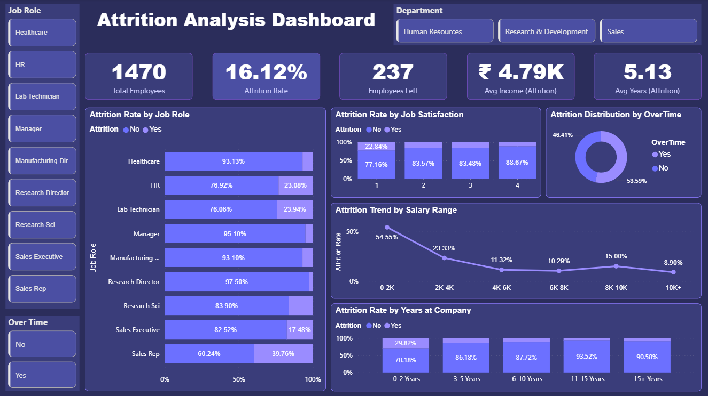

# 📊 Attrition Analysis Dashboard

An interactive Power BI dashboard built to analyze employee attrition patterns across job roles, departments, salary ranges, and tenure.

---

## Short Description / Purpose

This dashboard helps HR teams and business leaders understand why employees are leaving — by visualizing attrition rates across key dimensions like job satisfaction, overtime, salary range, and years at the company.

---

## File Format

- `.pbix` — Power BI dashboard template (open in Power BI Desktop)
- `.csv` — Dataset used to build the dashboard
- `.png` — Preview screenshot of the final dashboard

---

## Data Source

- Dataset: IBM HR Employee Attrition Dataset
- Records: 1,470 employees
- Columns: Age, Attrition, Department, Job Role, Job Satisfaction, Monthly Income, OverTime, Years at Company, Salary Range, and more
- Source: Publicly available HR analytics dataset

---

## Features / Highlights

### Business Problem
Employee attrition is a major cost for organizations. Identifying which roles, salary bands, or satisfaction levels are most prone to attrition helps HR teams take proactive steps to retain talent before it's too late.

### Goal of the Dashboard
To deliver a clear and interactive HR analytics tool that helps stakeholders:
- Monitor overall attrition rate and headcount
- Identify high-risk job roles and departments
- Understand the impact of overtime and salary on attrition
- Analyze attrition trends by tenure and job satisfaction

### Walkthrough of Key Visuals

- KPI Cards — Total Employees (1,470), Attrition Rate (16.12%), Employees Left (237), Avg Income Attrition (₹4.79K), Avg Years Attrition (5.13)
- Attrition Rate by Job Role (Stacked Bar Chart) — Sales Rep has the highest attrition at 39.76%, Research Director the lowest at 2.50%
- Attrition Rate by Job Satisfaction (Grouped Bar Chart) — Employees with satisfaction level 1 show the highest attrition at 22.84%
- Attrition Distribution by OverTime (Donut Chart) — 46.41% of attrition employees were working overtime
- Attrition Trend by Salary Range (Line Chart) — Employees earning 0-2K have the highest attrition rate at 54.55%
- Attrition Rate by Years at Company (Stacked Bar Chart) — Employees with 0-2 years tenure show 29.82% attrition
- Slicers — Filter by Job Role, Department, and OverTime status

### Business Impact & Insights

- Sales Reps have the highest attrition — targeted retention programs needed for this role
- Low salary (0-2K range) is the biggest driver of attrition — compensation review is critical
- Employees working overtime are significantly more likely to leave — workload balance needs attention
- New joiners (0-2 years) are most at risk — better onboarding and early engagement can help
- Low job satisfaction directly correlates with higher attrition — regular feedback mechanisms are essential

---

## Screenshots / Demos

